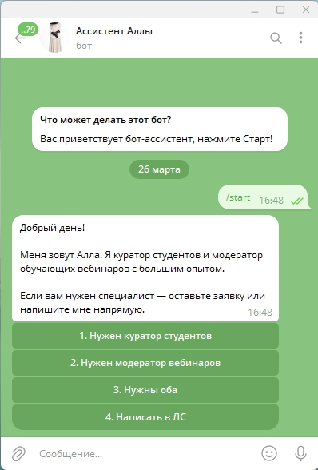
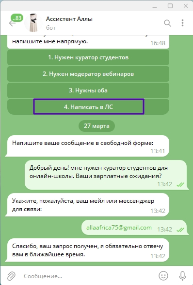
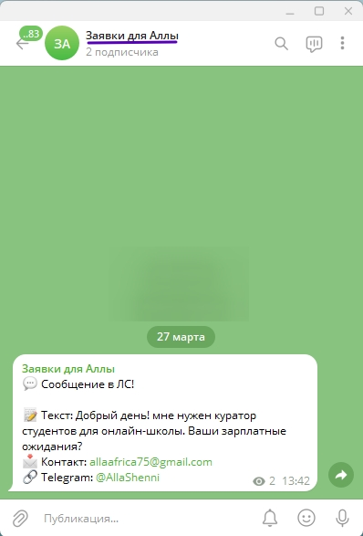

# Бот-ассистент Аллы
## Как это выглядит у меня

Telegram-бот для эксперта-куратора и модератора вебинаров по приёму заявок от клиентов.

Бот создан и работает на платформе [Replit](https://replit.com).

## Что умеет бот

- Показывает приветственное меню с кнопками при старте
- Принимает заявки на услуги куратора студентов и/или модератора вебинаров
- Собирает имя, цель и контакт клиента по шагам
- Принимает свободные сообщения с обязательным контактом для ответа
- Отправляет все заявки владельцу в личку со ссылкой на клиента

## Установка

1. Установите зависимости:
   pip install -r requirements.txt

2. Создайте бота через @BotFather в Telegram и получите токен

3. Узнайте свой Telegram ID через @userinfobot

4. Задайте переменные окружения:
   - BOT_TOKEN — токен вашего бота
   - OWNER_ID — ваш Telegram ID

5. Запустите бота:
   python bot.py

## Что нужно изменить под себя

В файле `bot.py` найдите переменную `WELCOME_TEXT` и замените:
- **Имя** — "Алла" на ваше имя
- **Экспертность** — "куратор студентов и модератор обучающих вебинаров" на вашу специализацию
- **Кнопки меню** — в функции `main_keyboard()` замените названия услуг на свои

## Технологии

- Python 3.11
- aiogram 3.7
- Хостинг: Replit
